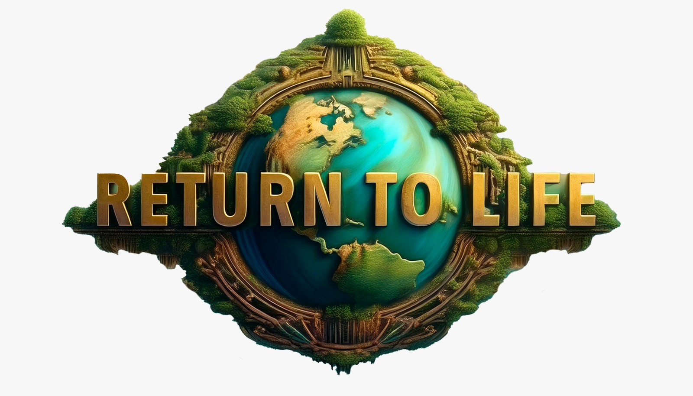

# RETURN TO LIFE 🎮 🌍



**RETURN TO LIFE** is a video game developed in Unreal Engine as part of the NASA GLOBE Game Challenge. It focuses on raising awareness about environmental issues and encourages players to participate in real-world data collection and conservation efforts through interactive gameplay.

🔗 **Download here the videogame**: <a href="https://www.dropbox.com/scl/fi/1j8yjh7p22mnjgiuqjhz5/ReturnToLife_v1.zip?rlkey=1uet5svfwjsev4grgprzzcln5&st=opus8qzj&dl=0" target="_blank">Download ReturnToLife_v1</a>


## Overview 🌿

In *RETURN TO LIFE*, players take on the role of a scientist tasked with restoring life to a devastated ecosystem. The game integrates elements of survival, exploration, and puzzle-solving as players work to rebuild the environment, all while learning about the real-world impact of climate change, deforestation, and other environmental challenges.

As part of the NASA GLOBE Program, the game encourages players to participate in citizen science by contributing real data to help scientists around the world understand and protect the Earth's natural systems.

🔗 **Check out our landing page on Figma**: <a href="https://www.figma.com/proto/ejbls4ndxBE0QjWJyTmB3c/NASA-Hackathon?page-id=0%3A1&node-id=89-296&node-type=frame&viewport=2760%2C578%2C0.17&t=mYgf6hZAftLYZT34-1&scaling=contain&content-scaling=fixed" target="_blank">RETURN TO LIFE - Landing Page</a>


## Features 🚀

- 🎮 **Unreal Engine Graphics**: Stunning 3D environments powered by Unreal Engine that bring the beauty and fragility of the ecosystem to life.
- 📚 **Educational Gameplay**: Learn about environmental science and the impact of climate change through interactive challenges.
- 🌍 **Citizen Science Integration**: Direct participation in the NASA GLOBE Program by submitting in-game data for real-world scientific research.
- 🧩 **Exploration and Survival**: Explore diverse biomes and restore them by collecting resources, solving puzzles, and managing survival elements like weather conditions and limited resources.
- 🤝 **Multiplayer Mode**: Work together with other players to restore large-scale ecosystems and tackle global environmental challenges.

## Installation 💻

To get started with *RETURN TO LIFE*, follow these steps:

1. Clone this repository:
   ```bash
   git clone https://github.com/your-username/return-to-life.git
   ```
2. Open the project in Unreal Engine:
   - Download [Unreal Engine](https://www.unrealengine.com/) if you haven't already.
   - Open the project file (`.uproject`) in the Unreal Engine editor.
   
3. Build the game:
   - In Unreal Engine, click on the `Build` option to compile the project.

4. Play the game:
   - Once compiled, you can launch the game directly from the Unreal Engine editor.

## Gameplay Instructions 🎯

### Objective 🌍

In RETURN TO LIFE, players will choose between six unique zones of the planet, each representing a different ecosystem, such as forests, deserts, oceans, and glaciers. The ultimate goal is to heal and restore life to these devastated environments.

🌳 Forest Zone: Reforest and balance carbon reduction by measuring soil pH and other environmental factors.
🏜 Desert Zone: Reclaim arid lands by revitalizing water sources and managing extreme temperatures.
🌊 Ocean Zone: Monitor and regulate water temperature to preserve coral reefs and marine life.
❄️ Glacier Zone: Protect and rebuild the ice caps by addressing melting glaciers and rising sea levels.
🏙 Urban Zone: Restore green spaces and promote sustainability in urban areas by reducing pollution and waste.
💧 Lake Zone: Balance freshwater ecosystems by revitalizing lakes, rivers, and wetlands.

Players will explore these zones, collect resources, solve environmental puzzles, and gather real-world environmental data that contributes to global efforts to restore the planet's balance. The game's focus is on teaching the player about the importance of climate action and ecosystem restoration through interactive and engaging gameplay.

## Requirements to Play 🖥️
Before diving into RETURN TO LIFE, ensure that your system meets the minimum or recommended specifications to ensure smooth gameplay.

### Minimum Requirements
- OS: Windows 10 (64-bit)
- Processor: Intel Core i5-8400 / AMD Ryzen 3 3300X
- Memory: 8 GB RAM
- Graphics: NVIDIA GeForce GTX 1060 / AMD Radeon RX 580 (4GB VRAM)
- DirectX: Version 11
- Storage: 20 GB available space
- Additional Notes: The game may run on lower-end hardware, but performance will vary significantly, especially in graphically intensive zones like Forests and Oceans.

## Recommended Requirements
- OS: Windows 10/11 (64-bit)
- Processor: Intel Core i7-9700K / AMD Ryzen 5 3600X
- Memory: 16 GB RAM
- Graphics: NVIDIA GeForce RTX 2060 / AMD Radeon RX 5700 XT (6GB VRAM)
- DirectX: Version 12
- Storage: 20 GB available space (SSD recommended for faster loading times)
- Additional Notes: To experience the game in high settings and enjoy smooth gameplay, especially   in detailed environments like the Glacier Zone or Urban Zone, it is recommended to have a system that meets or exceeds these specs.
Peripherals
- Controller: Supports Xbox and PlayStation controllers for enhanced gameplay experience.
- Mouse and Keyboard: Fully supported for players who prefer a traditional setup.

## Internet Requirements
- Internet Connection: Required for multiplayer modes and contributing real-world data to the NASA - GLOBE program. Offline play is available for single-player mode.

### Controls 🎮⬆️🖱️

- **W/A/S/D**: Move your character.
- **Space**: Jump.
- **Mouse**: Look around.
- **Esc**: Escape.

#### Special Powers 🎮🌊🌳
- **1**: Water Shield.
- **2**: Water Wave.
- **3**: Water Rain.
- **4**: Soil Ph Scan.
- **5**: Purify acidity or alkaline ground.
- **6**: Plant trees.
- **Left Click**: Water projectile.

### Contributing to the NASA GLOBE Program 🌍

In addition to the in-game mechanics, players are encouraged to participate in the NASA GLOBE Program by collecting real-world environmental data using the [GLOBE Observer App](https://observer.globe.gov/about/get-the-app). This data will directly contribute to scientific research about our planet.

## Development Team 👨‍💻👩‍💻

- **Game Developer & Unreal Developer**: [Eder Luis Santander](https://www.linkedin.com/in/eder-luis-santander-cjuno-b81b994b/)
- **Game Developer & Game Design**: [Yuri Portugal](https://www.linkedin.com/in/yuri-portugal/)
- **Software Developer**: [Katherine Soto](https://www.linkedin.com/in/katherinesoto/)

## Product & Design Team 👨‍💻👩‍💻

- **Product Management**: [Diana Ricaldes](https://www.linkedin.com/in/diana-ricaldes-18496175/)
- **UX Designer**: [Karina Aquise](https://www.linkedin.com/in/karinaquise/)
- **UX/UI Design**: [Sulmairy García](https://www.linkedin.com/in/sulmairygarcia/)

## License 📄

This project is licensed under the MIT License - see the [LICENSE](LICENSE) file for details.

## Acknowledgments 🙌

- Special thanks to NASA for organizing the GLOBE Game Challenge and for their continued efforts in environmental conservation.
- [Unreal Engine](https://www.unrealengine.com/) for providing the tools necessary to bring this project to life.
- All participants of the GLOBE Program for their contributions to the study of Earth's environment.

## Contact 📧

For any inquiries, suggestions, or feedback, feel free to reach out to us via linkedIn
